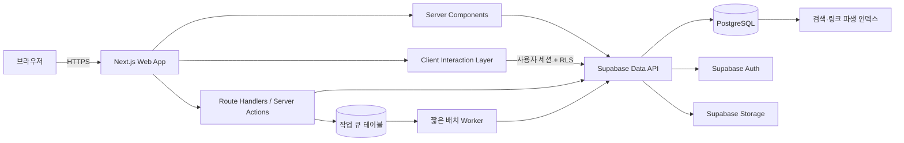

# 아무위키(AmuWiki) — 제품·기술 설계서

> 상태: 설계 초안 v0.5  
> 범위: 프로덕션 개발 전 아키텍처·UX·데이터 계약 확정  
> 이 문서는 구현 코드가 아니다. 승인 후 본 문서를 기준으로 MVP를 개발한다.

## 1. 제품 정의

아무위키는 한 명의 사용자가 여러 기기에서 사용하는 클라우드 기반 개인 위키다. **아무나 시작할 수 있고, 아무거나 기록할 수 있는 위키**를 지향하지만 첫 번째 사용자는 제품을 만드는 본인이다. 공공 백과사전이나 협업 플랫폼보다 개인의 기억, 관심사, 조사와 생각을 자유롭게 축적하는 도구에 가깝다.

첫 MVP의 제품 표면은 **소유자 1인 전용**으로 제한한다. 다만 데이터 모델과 RLS는 사용자별 소유권을 전제로 설계해 향후 가입 개방 시 핵심 스키마를 다시 만들지 않는다.

핵심 차별점은 문서를 떠나지 않고 개념과 연결 문서를 연쇄 탐색하는 **중첩 지식 카드(Nested Knowledge Cards)** 다. 초기 제품은 철저히 개인적 필요를 해결하며, 수익화와 다중 사용자 확장은 이 경험이 충분히 검증된 이후의 선택지로 남긴다.

### 제품 정체성

- **아무나:** 기술 지식 없이도 시작할 수 있다.
- **아무거나:** 일기, 공부, 인물, 작품, 코드, 업무 기록 등 문서 종류를 제한하지 않는다.
- **나부터:** 초기 의사결정은 불특정 다수보다 소유자의 실제 사용 빈도와 만족도를 우선한다.
- **내 데이터:** 언제든 Markdown과 첨부파일 전체를 내보낼 수 있다.
- **조용한 도구:** 서비스 홍보, 추천 피드와 불필요한 설명보다 기록과 탐색을 앞세운다.

### 핵심 사용자 흐름

1. 사용자가 검색 또는 최근 문서에서 문서를 연다.
2. 본문 속 등록된 개념에 마우스를 올리거나 키보드 포커스를 두면 짧은 미리보기가 열린다.
3. 개념을 클릭하면 조작 가능한 카드로 고정된다.
4. 고정 카드 안의 개념을 다시 열어 연쇄적으로 탐색한다.
5. 개념이나 연결 문서의 미리보기에서 관련 문서를 이어서 확인한다.
6. 문장의 일부를 선택해 개인 주석을 남기고 나중에 다시 찾는다.
7. 화면에는 최대 3개 카드만 보이고, 이전 카드는 탐색 경로로 접힌다.
8. 상세한 내용이 필요하면 카드에서 전체 문서를 연다.

### MVP 목표

- 개인 계정으로 안전하게 로그인한다.
- Markdown 문서를 작성·수정·삭제·복구한다.
- 문서 제목과 별칭을 개념으로 인식한다.
- 호버 미리보기와 드래그 가능한 고정 카드를 제공한다.
- 개념 및 연결 문서의 미리보기에서 관련 문서를 제공한다.
- 선택한 본문 구간에 개인 주석을 작성·수정·보관한다.
- 문서·본문·별칭을 빠르게 검색한다.
- 최근 문서와 최근 검색어를 동기화한다.
- 색상 테마, 명암 모드, 글꼴, 글자 크기와 본문 폭을 선택한다.
- Markdown과 첨부파일을 내보낼 수 있다.
- 여러 Markdown 파일 또는 Obsidian 형식의 ZIP을 분석한 뒤 일괄 가져올 수 있다.

### MVP에서 제외

- 다중 사용자 협업, 공개 공유와 권한 그룹
- 실시간 공동 편집
- AI가 원문을 자동 수정하거나 태그를 자동 부여하는 기능 (AI는 13절의 BYOK 제안 방식으로만 도입)
- 그래프 시각화 화면
- 네이티브 모바일 앱
- 사용자가 직접 웹폰트를 업로드하는 기능
- 주석 공유, 멘션, 댓글 스레드
- 광고, 구독 결제와 공개 콘텐츠 수익화
- 문단·블록을 독립 객체로 저장하고 링크하는 블록 기반 편집
- 로컬 Markdown 폴더와 클라우드 DB의 지속적 양방향 동기화

## 2. 설계 원칙

1. **콘텐츠 우선:** 첫 화면과 문서 화면에서 본문을 가장 강하게 보인다.
2. **문맥 유지:** 개념 확인 때문에 현재 문서와 읽던 위치를 잃지 않는다.
3. **점진적 공개:** 호버에는 짧은 정의, 고정 카드에는 요약, 전체 내용은 문서에 둔다.
4. **이식 가능성:** Markdown이 원본이며 서비스가 없어져도 데이터를 복구할 수 있어야 한다.
5. **안전한 기본값:** 비공개, 최소 권한, 원시 HTML 차단, 소프트 삭제가 기본이다.
6. **선택은 제공하되 복잡성은 숨김:** 테마와 글꼴은 프리셋만 제공하고 세부 토큰 편집은 MVP에서 제외한다.
7. **모바일 동등성:** 호버가 없는 환경에서도 탭과 하단 시트로 동일한 정보를 탐색한다.
8. **개인성 우선:** 대중적 기능보다 소유자가 매일 쓰는 흐름을 우선하고, 사회적 지표나 피드는 넣지 않는다.
9. **설명보다 조작:** 화면에 상시 노출되는 안내 문장을 최소화하고 필요한 도움말은 문맥형 `?` 가이드로 제공한다.
10. **문서 중심 모델:** MVP의 개념 최소 단위는 문서이며 문단·블록에는 독립 ID나 링크 수명주기를 부여하지 않는다.
11. **DB가 최종 원본:** Markdown은 가져오기·백업·내보내기 형식이며, 운영 중 정본은 클라우드 DB다.

## 3. 시스템 아키텍처

### 기술 선택

| 영역 | 선택 | 이유 |
|---|---|---|
| 웹 애플리케이션 | Next.js App Router + TypeScript strict | 서버 렌더링과 상호작용 영역을 분리하고 경로·메타데이터·API를 한 프로젝트에서 관리 |
| UI | React, CSS variables, 접근성 프리미티브 | 중첩 카드와 키보드 포커스 같은 복잡한 상호작용을 명시적으로 제어 |
| 데이터·인증·파일 | Supabase Postgres, Auth, Storage | 관리 대상 서비스를 줄이고 DB·인증·첨부 권한을 RLS로 통합 |
| 원문 형식 | CommonMark 기반 Markdown + Wiki link 확장 | 장기 보존과 내보내기 용이성 |
| 검색 | PostgreSQL trigram + 정규화된 제목·별칭 인덱스 | 한글 부분 검색을 단순하고 예측 가능하게 제공 |
| 비동기 작업 | Postgres 작업 테이블 + 짧은 배치 Worker | 가져오기·내보내기·물리 삭제를 요청 수명과 분리하고 재시도 가능하게 처리 |
| 배포 | Edge/Worker 호환 Next.js 배포 + Supabase HTTPS API | 서버 파일시스템과 장기 실행 프로세스에 의존하지 않음 |
| 품질 | Vitest, Testing Library, Playwright | 렌더 파이프라인·상태 로직·핵심 사용자 흐름을 계층별 검증 |

Next.js App Router는 기본적으로 페이지와 레이아웃을 Server Component로 처리하고, 상태·이벤트·브라우저 API가 필요한 부분만 Client Component로 분리할 수 있다. 아무위키에서는 문서 조회·초기 렌더는 서버, 검색창·편집기·중첩 카드·드래그·주석 앵커링은 클라이언트 책임으로 둔다. [Next.js 공식 문서](https://nextjs.org/docs/app/getting-started/server-and-client-components)

Supabase의 브라우저 접근은 모든 노출 테이블에 RLS와 명시적 권한을 적용한다. `service_role` 키는 브라우저 번들에 포함하지 않는다. [Supabase RLS 문서](https://supabase.com/docs/guides/database/postgres/row-level-security)

### 논리 구조



### 렌더링 경계

- Server Component
  - 문서 페이지 셸과 초기 문서 데이터
  - 메타데이터와 오류·빈 상태
  - 최근 문서 초기 목록
- Client Component
  - Command 검색창
  - Markdown 편집기와 미리보기
  - 중첩 카드 스택과 드래그
  - 텍스트 선택과 주석 앵커 표시
  - 테마·글꼴 전환
  - 모바일 사이드바와 하단 시트
- 서버 전용
  - 입력 검증과 변경 충돌 검사
  - Markdown 파싱·정제
  - 링크/별칭 재색인
  - 가져오기 압축 해제·분석·배치 반영
  - 내보내기 묶음 생성
  - 만료 작업과 소프트 삭제 데이터 정리

## 4. 저장소 및 파일 구조

```text
my-wiki/
├── app/
│   ├── (auth)/
│   │   └── login/page.tsx
│   ├── (wiki)/
│   │   ├── layout.tsx
│   │   ├── page.tsx
│   │   ├── documents/[slug]/page.tsx
│   │   ├── documents/[slug]/edit/page.tsx
│   │   ├── search/page.tsx
│   │   ├── trash/page.tsx
│   │   ├── settings/page.tsx
│   │   └── settings/import/page.tsx
│   ├── api/v1/
│   │   ├── documents/route.ts
│   │   ├── documents/[id]/route.ts
│   │   ├── documents/[id]/revisions/route.ts
│   │   ├── documents/[id]/preview/route.ts
│   │   ├── documents/[id]/related/route.ts
│   │   ├── annotations/route.ts
│   │   ├── annotations/[id]/route.ts
│   │   ├── search/route.ts
│   │   ├── recent-views/route.ts
│   │   ├── recent-searches/route.ts
│   │   ├── preferences/route.ts
│   │   ├── attachments/route.ts
│   │   ├── imports/route.ts
│   │   ├── imports/[id]/route.ts
│   │   ├── imports/[id]/analyze/route.ts
│   │   ├── imports/[id]/commit/route.ts
│   │   ├── exports/route.ts
│   │   └── exports/[id]/route.ts
│   ├── globals.css
│   └── layout.tsx
├── components/
│   ├── shell/
│   │   ├── app-header.tsx
│   │   ├── wiki-sidebar.tsx
│   │   └── site-footer.tsx
│   ├── document/
│   │   ├── document-reader.tsx
│   │   ├── document-editor.tsx
│   │   ├── document-toc.tsx
│   │   └── markdown-renderer.tsx
│   ├── concept/
│   │   ├── concept-trigger.tsx
│   │   ├── transient-preview.tsx
│   │   ├── pinned-card.tsx
│   │   ├── related-documents.tsx
│   │   ├── card-layer.tsx
│   │   └── exploration-trail.tsx
│   ├── annotation/
│   │   ├── text-selection-menu.tsx
│   │   ├── annotation-anchor.tsx
│   │   ├── annotation-editor.tsx
│   │   └── annotation-panel.tsx
│   ├── help/
│   │   └── guide-tooltip.tsx
│   ├── search/
│   │   └── command-search.tsx
│   ├── import/
│   │   ├── import-dropzone.tsx
│   │   ├── import-analysis.tsx
│   │   └── import-progress.tsx
│   └── settings/
│       └── appearance-controls.tsx
├── features/
│   ├── documents/
│   ├── concepts/
│   ├── annotations/
│   ├── related-documents/
│   ├── imports/
│   ├── search/
│   ├── history/
│   └── preferences/
├── lib/
│   ├── auth/
│   ├── markdown/
│   │   ├── parse.ts
│   │   ├── wikilinks.ts
│   │   ├── concept-match.ts
│   │   └── sanitize.ts
│   ├── search/
│   ├── supabase/
│   │   ├── browser.ts
│   │   ├── server.ts
│   │   └── middleware.ts
│   ├── validation/
│   └── observability/
├── styles/
│   ├── tokens.css
│   ├── themes.css
│   └── typography.css
├── supabase/
│   ├── migrations/
│   ├── seed.sql
│   └── tests/
├── tests/
│   ├── unit/
│   ├── integration/
│   └── e2e/
├── workers/
│   ├── import-worker.ts
│   ├── export-worker.ts
│   └── cleanup-worker.ts
├── docs/
├── public/
└── package.json
```

기능별 비즈니스 로직은 `features/`, 재사용 가능한 표현 컴포넌트는 `components/`, 외부 시스템과 파싱 경계는 `lib/`에 둔다. 페이지 파일에 데이터 접근과 상태 로직을 누적하지 않는다.

## 5. 데이터 모델

모든 주요 ID는 UUID, 모든 시각은 `timestamptz`, 삭제는 기본적으로 `deleted_at`을 사용하는 소프트 삭제다.

### `profiles`

| 필드 | 형식 | 규칙 |
|---|---|---|
| `id` | uuid | `auth.users.id`와 동일, PK |
| `display_name` | text | 선택 |
| `created_at` | timestamptz | 필수 |
| `updated_at` | timestamptz | 필수 |

### `user_preferences`

| 필드 | 형식 | 기본값 |
|---|---|---|
| `user_id` | uuid PK/FK | 현재 사용자 |
| `theme_key` | enum | `paper-green` |
| `color_mode` | enum | `system` |
| `font_preset` | enum | `pretendard` |
| `font_scale` | enum | `normal` |
| `content_width` | enum | `normal` |
| `line_break_mode` | enum | `hard` |
| `tooltip_enabled` | boolean | `true` |
| `tooltip_delay_ms` | smallint | `450` |
| `tooltip_lock_mode` | enum | `click` |
| `updated_at` | timestamptz | 필수 |

UI 깜빡임을 막기 위해 마지막 설정을 로컬 저장소와 쿠키에도 캐시하지만 DB 값을 최종 원본으로 본다.

### `documents`

| 필드 | 형식 | 규칙 |
|---|---|---|
| `id` | uuid PK | 생성 시 발급 |
| `owner_id` | uuid FK | 필수, RLS 기준 |
| `slug` | text | 사용자별 고유 |
| `title` | text | 1~200자 |
| `summary` | text | 툴팁용 300자 이내 |
| `body_markdown` | text | 원본 데이터 |
| `frontmatter` | jsonb | 알 수 없는 YAML 키도 보존, 기본값 `{}` |
| `status` | enum | `draft`, `active`, `archived` |
| `version` | integer | 낙관적 잠금에 사용 |
| `created_at` | timestamptz | 필수 |
| `updated_at` | timestamptz | 필수 |
| `deleted_at` | timestamptz | 휴지통 이동 시 설정 |

인덱스: `(owner_id, updated_at desc)`, `(owner_id, slug) unique`, 제목 trigram GIN.

`summary`는 사용자가 직접 쓰거나 YAML의 `summary`/`description`에서 가져온 값을 우선한다. 비어 있으면 렌더된 첫 유효 문단에서 코드·이미지를 제외하고 최대 300자로 파생한다. 파생 요약은 원문을 수정하지 않으며 문서 저장 시 갱신한다.

### `document_aliases`

| 필드 | 형식 | 규칙 |
|---|---|---|
| `id` | uuid PK |  |
| `owner_id` | uuid FK | RLS 및 고유성 범위 |
| `document_id` | uuid FK | 대상 개념 문서 |
| `alias` | text | 사용자에게 보이는 표현 |
| `normalized_alias` | text | 검색·매칭용 정규화 값 |
| `created_at` | timestamptz | 필수 |

`(owner_id, normalized_alias)`는 고유해야 한다. 하나의 표현이 여러 문서를 가리키는 모호성은 MVP에서 허용하지 않는다.

MVP에서 **개념의 정식 식별자는 문서 ID**다. 별칭은 별도 개념이 아니라 항상 하나의 `document_id`로 해석된다. 문서 제목을 바꾸면 이전 제목을 별칭으로 자동 보존해 기존 Wiki link와 가져온 링크가 끊어지지 않게 한다. 사용자가 그 별칭을 명시적으로 삭제하려 할 때는 깨질 수 있는 참조 수를 먼저 보여준다.

### `document_links`

| 필드 | 형식 | 규칙 |
|---|---|---|
| `source_document_id` | uuid FK | 출발 문서 |
| `target_document_id` | uuid FK | 연결된 개념 |
| `link_kind` | enum | `explicit`, `automatic` |
| `occurrence_count` | integer | 최소 1 |
| `first_position` | integer | 첫 등장 위치 |
| `updated_at` | timestamptz | 재색인 시각 |

PK는 `(source_document_id, target_document_id, link_kind)`다. 백링크는 이 테이블을 역방향으로 조회한다.

### 관련 문서 산정

관련 문서는 별도 추천 서비스 없이 `document_links`를 기반으로 계산한다. 결과에는 선정 이유를 함께 제공해 사용자가 연결을 이해할 수 있게 한다.

1. 현재 문서를 직접 가리키거나 현재 문서가 가리키는 문서
2. 공통으로 연결된 개념 수가 많은 문서
3. 동점이면 최근 수정 문서

직접 연결은 간접 유사도보다 항상 높은 순위를 갖는다. 자기 자신, 삭제·보관 문서, 권한이 없는 문서는 제외하고 최대 5개를 반환한다. 문서가 적은 MVP에서는 SQL 함수로 계산하고, 규모가 커지면 결과 캐시나 별도 추천 인덱스로 교체할 수 있도록 서비스 인터페이스를 분리한다.

태그 기반 추천은 정규화된 태그 모델을 도입하기 전까지 사용하지 않는다. 가져온 YAML의 `tags` 값은 `frontmatter`에 손실 없이 보존하되 MVP 랭킹에는 반영하지 않는다.

### `document_revisions`

| 필드 | 형식 | 규칙 |
|---|---|---|
| `id` | uuid PK |  |
| `document_id` | uuid FK |  |
| `revision_number` | integer | 문서별 증가 |
| `title` | text | 변경 당시 제목 |
| `summary` | text | 변경 당시 요약 |
| `body_markdown` | text | 변경 당시 본문 |
| `frontmatter` | jsonb | 변경 당시 YAML 속성 |
| `created_at` | timestamptz | 필수 |

사용자가 저장할 때만 리비전을 만들며 자동 저장 임시 상태는 브라우저 로컬 저장소에 둔다. 문서별 최근 100개를 기본 보존하고, 보존 정책은 설정 가능하도록 확장 여지를 둔다.

### `annotations`

개인 주석은 문서의 특정 텍스트 구간에 붙는 메모다. 댓글이나 협업 대화가 아니라 사용자의 보충 설명, 의문, 할 일을 남기는 기능이다.

| 필드 | 형식 | 규칙 |
|---|---|---|
| `id` | uuid PK | 생성 시 발급 |
| `owner_id` | uuid FK | 필수, RLS 기준 |
| `document_id` | uuid FK | 대상 문서 |
| `document_revision` | integer | 주석 생성 당시 문서 버전 |
| `body_markdown` | text | 1~4,000자 |
| `color_key` | enum | `yellow`, `blue`, `green`, `red` |
| `status` | enum | `active`, `resolved`, `orphaned` |
| `anchor_start` | integer | 정규화된 평문 시작 위치 |
| `anchor_end` | integer | 정규화된 평문 끝 위치 |
| `quote_exact` | text | 선택한 원문 |
| `quote_prefix` | text | 앞쪽 문맥, 최대 64자 |
| `quote_suffix` | text | 뒤쪽 문맥, 최대 64자 |
| `anchor_version` | smallint | 정규화·재연결 알고리즘 버전, 기본값 1 |
| `created_at` | timestamptz | 필수 |
| `updated_at` | timestamptz | 필수 |
| `deleted_at` | timestamptz | 휴지통 처리 |

텍스트 위치만 저장하면 문서 편집 후 주석이 쉽게 어긋난다. 따라서 위치와 함께 exact/prefix/suffix 인용 앵커를 보관한다. 문서가 변경되면 정확한 인용문, 주변 문맥, 가까운 위치 순으로 다시 연결한다. 자동 연결에 실패하면 원문을 잃지 않고 `orphaned`로 표시하며 사용자가 새 위치를 지정할 수 있게 한다.

주석은 문서 리비전에 포함하지 않고 별도 이력을 가진다. 문서 복원 때문에 주석을 자동 삭제하지 않는다.

앵커 구조는 W3C Web Annotation의 `TextQuoteSelector`와 `TextPositionSelector` 조합을 따른다. 위치만 신뢰하지 않고 인용문과 앞뒤 문맥을 함께 저장하며, 정규화 규칙이 바뀌면 `anchor_version`으로 점진적으로 이전한다. [W3C Web Annotation Data Model](https://www.w3.org/TR/annotation-model/)

### `recent_views`

| 필드 | 형식 | 규칙 |
|---|---|---|
| `user_id` | uuid FK | PK 일부 |
| `document_id` | uuid FK | PK 일부 |
| `last_viewed_at` | timestamptz | 최근 순서 |
| `view_count` | integer | 누적 횟수 |
| `hidden_at` | timestamptz | 목록에서 제거할 때 설정 |

목록의 “편집”은 문서를 삭제하는 것이 아니라 `hidden_at`만 설정한다. 문서를 다시 열면 이를 초기화한다.

### `recent_searches`

| 필드 | 형식 | 규칙 |
|---|---|---|
| `user_id` | uuid FK | PK 일부 |
| `normalized_query` | text | PK 일부 |
| `display_query` | text | 마지막 입력 표기 |
| `last_searched_at` | timestamptz | 최근 순서 |
| `search_count` | integer | 누적 횟수 |

### `attachments`

| 필드 | 형식 | 규칙 |
|---|---|---|
| `id` | uuid PK |  |
| `owner_id` | uuid FK | RLS 기준 |
| `document_id` | uuid FK | 연결 문서 |
| `storage_path` | text | 사용자 ID로 시작하는 경로 |
| `original_name` | text | 표시용 |
| `mime_type` | text | 허용 목록 검사 |
| `size_bytes` | bigint | 용량 제한 검사 |
| `sha256` | text | 중복·무결성 검사 |
| `created_at` | timestamptz | 필수 |
| `deleted_at` | timestamptz | 소프트 삭제 |

Storage 버킷은 비공개이며, 사용자별 폴더 RLS와 짧은 수명의 서명 URL을 사용한다. Supabase Storage도 `storage.objects`에 RLS 정책을 적용한다. [Storage 접근 제어 문서](https://supabase.com/docs/guides/storage/security/access-control)

### `import_jobs`

| 필드 | 형식 | 규칙 |
|---|---|---|
| `id` | uuid PK | 생성 시 발급 |
| `owner_id` | uuid FK | 필수, RLS 기준 |
| `source_kind` | enum | `markdown-files`, `markdown-zip`, `obsidian-vault` |
| `status` | enum | `uploaded`, `analyzing`, `ready`, `importing`, `completed`, `partial`, `failed`, `cancelled` |
| `storage_path` | text | 원본 업로드 임시 경로 |
| `conflict_policy` | enum | `skip`, `rename`; MVP에서는 덮어쓰기 금지 |
| `stats` | jsonb | 파일·문서·첨부·경고·실패 수 |
| `error_summary` | text | 민감한 본문을 제외한 오류 요약 |
| `created_at` | timestamptz | 필수 |
| `completed_at` | timestamptz | 선택 |
| `expires_at` | timestamptz | 원본·보고서 정리 시각 |

### `import_items`

| 필드 | 형식 | 규칙 |
|---|---|---|
| `id` | uuid PK |  |
| `job_id` | uuid FK | 가져오기 작업 |
| `relative_path` | text | ZIP 또는 선택 폴더 기준 경로 |
| `content_sha256` | text | 재시도 중복 방지 |
| `item_kind` | enum | `document`, `attachment`, `ignored` |
| `detected_title` | text | 분석 단계에서 결정 |
| `planned_slug` | text | 충돌 정책 적용 결과 |
| `status` | enum | `pending`, `ready`, `imported`, `skipped`, `failed` |
| `target_document_id` | uuid FK | 성공한 문서, 선택 |
| `warning_codes` | text[] | 미지원 문법·깨진 링크 등 |

`(job_id, relative_path)`는 고유하다. 작업을 다시 실행해도 `content_sha256`와 완료된 항목을 확인해 문서를 중복 생성하지 않는다. 원본 업로드와 상세 보고서는 기본 7일 뒤 물리 삭제한다.

### `export_jobs`

| 필드 | 형식 | 규칙 |
|---|---|---|
| `id` | uuid PK |  |
| `owner_id` | uuid FK | 필수, RLS 기준 |
| `status` | enum | `queued`, `running`, `completed`, `failed`, `expired` |
| `storage_path` | text | 완성 ZIP의 비공개 경로 |
| `stats` | jsonb | 문서·첨부 수와 전체 크기 |
| `created_at` | timestamptz | 필수 |
| `expires_at` | timestamptz | 다운로드 만료 시각 |

내보내기는 요청 안에서 ZIP 생성을 끝내지 않는다. 작업 완료 후 짧은 수명의 서명 URL을 발급하고, 만료 뒤 생성물을 삭제한다.

## 6. 개념 인식과 Markdown 정책

### 편집기 계약

- 데스크톱은 **좌측 Markdown 편집기 + 우측 렌더 미리보기**의 분할 화면을 기본으로 확정한다.
- 작은 화면은 `편집`과 `미리보기` 탭을 전환한다.
- 읽기 화면에서는 링크 호버만으로 미리보기를 열지만, 편집 화면에서는 텍스트 선택과 충돌하지 않도록 `Cmd/Ctrl + 호버`에서만 연다.
- 자동 저장 임시는 브라우저 로컬 저장소에 두고, 사용자가 저장할 때 서버 리비전과 링크 재색인을 함께 만든다.
- 서버 버전이 달라졌다면 자동 덮어쓰지 않고 비교·복제 저장·명시적 덮어쓰기 선택지를 제공한다.
- 기본값은 `hard`다. 즉, 편집기에서 Enter 한 번을 읽기 화면의 줄바꿈으로 렌더링한다. 설정 화면에서 `soft`(CommonMark 기본값)와 선택할 수 있게 한다.

### 지원 문법

- `[[문서 제목]]`
- `[[문서 제목|본문에 보일 표현]]`
- 일반 Markdown 링크·제목·표·인용·코드 블록
- 원시 HTML은 기본적으로 허용하지 않음

### 자동 개념 링크

1. 저장 시 문서 제목과 별칭 사전을 불러온다.
2. Markdown을 AST로 파싱한다.
3. 코드, 기존 링크, 제목, 이미지 대체 텍스트 영역은 자동 매칭에서 제외한다.
4. 긴 별칭부터 우선 매칭한다.
5. 한 문서에서 자동 링크는 각 개념의 첫 번째 유효 등장에만 표시한다.
6. 명시적인 Wiki link는 횟수 제한 없이 표시한다.
7. 자기 자신을 가리키는 자동 링크는 만들지 않는다.
8. 파생된 연결을 `document_links`에 트랜잭션으로 교체한다.

원문에는 자동 링크 마크업을 삽입하지 않는다. 별칭이 변경되어도 원문이 오염되지 않고 언제든 재색인할 수 있어야 한다.

### Markdown·Obsidian 가져오기

MVP는 개별 `.md`/`.markdown` 파일의 다중 선택과 Markdown 폴더 또는 Obsidian vault를 담은 `.zip`을 지원한다. 로컬 폴더를 서버와 계속 동기화하지 않으며, 가져오기는 명시적인 일회성 복사 작업이다.

#### 2단계 처리

1. **분석:** 원본을 임시 비공개 Storage에 올리고 파일 구조, 제목, YAML frontmatter, Wiki link, Markdown 링크, 첨부 경로와 충돌을 검사한다. 이 단계에서는 문서를 만들지 않는다.
2. **확정:** 사용자가 요약과 경고를 검토하고 충돌 정책을 선택한 뒤 가져오기를 실행한다. 완료 화면에서 성공·건너뜀·실패 파일과 깨진 링크를 내려받을 수 있다.

분석 결과에는 총 파일 수, 가져올 문서와 첨부 수, 중복 제목·별칭, 해석하지 못한 링크, 미지원 문법, 예상 저장 용량을 표시한다. 먼저 10개 이하의 표본 문서를 렌더링해 원문과 결과를 비교할 수 있게 한다.

#### 변환 규칙

- 파일명은 기본 제목으로 사용하되 YAML `title`이 있으면 우선한다.
- 알려진 `aliases`는 `document_aliases`로 옮기고, 나머지 YAML 키는 `frontmatter`에 보존한다.
- 같은 작업에 포함된 모든 문서의 경로·제목 카탈로그를 먼저 만든 뒤 Wiki link와 상대 Markdown 링크를 해석한다.
- 경로가 명시된 링크는 정확한 상대 경로를 우선하고, 그다음 제목·별칭을 사용한다.
- `[[문서#제목]]`, `[[문서|표시명]]`은 원문을 보존하고 문서 단위 링크를 색인한다. 블록 참조, Dataview 쿼리와 플러그인 전용 문법은 실행하지 않고 원문과 경고를 남긴다.
- 상대 경로 이미지와 첨부파일은 같은 ZIP에 있을 때 비공개 Storage로 복사하고 링크를 새 경로로 치환한다.
- 해석하지 못한 링크는 평문으로 없애지 않고 깨진 Wiki link 상태로 보존한다.
- 중복 충돌의 기본값은 `skip`이며 선택적으로 안전한 접미사를 붙이는 `rename`을 제공한다. 기존 문서 덮어쓰기·병합은 MVP에서 제외한다.
- 결과는 바이트 단위 동일성을 보장하지 않지만 본문, 알 수 없는 frontmatter와 미지원 확장을 가능한 한 원문 그대로 보존한다.

#### 제한과 안전

- 기본 제한은 ZIP 250MB, 파일 5,000개, Markdown 파일당 5MB, 단일 첨부 25MB이며 배포 환경변수로 더 낮출 수 있다.
- ZIP 경로 이탈, 심볼릭 링크, 과도한 압축률, 실행 파일, 허용되지 않은 MIME을 거부한다.
- `.obsidian`, 숨김 파일과 운영체제 메타파일은 문서로 가져오지 않는다. 필요한 별칭·링크 정보만 Markdown/YAML에서 읽는다.
- 큰 작업은 작은 배치로 처리하고 진행률과 마지막 처리 항목을 저장한다. 일부 실패는 성공 항목을 되돌리지 않고 `partial` 상태와 재시도 가능한 보고서로 남긴다.

Notion과 Capacities처럼 가져오기 전에 구조와 충돌을 분석하고 진행·완료 상태를 보여주는 방식을 채택한다. 특히 연결된 Markdown 문서는 같은 작업에서 함께 해석해야 링크 손실이 줄어든다. [Notion 가져오기 안내](https://www.notion.com/help/import-data-into-notion), [Capacities Obsidian 가져오기](https://docs.capacities.io/migration/import-from-obsidian)

### 툴팁 데이터

미리보기 API는 전체 Markdown이 아닌 다음 정보만 반환한다.

- 문서 ID, slug, 제목
- 300자 이내 요약
- 카드 안에서 연결할 수 있는 최대 5개 개념
- 관련 문서 최대 3개와 연결 이유
- 마지막 수정 시각

### 개념·연결 문서의 관련 문서 표시

- 개념에 호버하면 요약 아래에 관련 문서 최대 3개를 제목만 표시한다.
- 연결 문서 링크에 호버하면 해당 문서의 요약과 관련 문서 최대 3개를 표시한다.
- 클릭해 고정한 카드에서는 관련 문서 최대 5개와 `직접 연결`, `공통 개념 3개` 같은 이유를 표시한다.
- 관련 문서를 선택하면 기존 문서를 즉시 교체하지 않고 새 지식 카드로 연다.
- `문서 열기`를 명시적으로 선택했을 때만 본문 라우트로 이동한다.
- 관련 문서 목록 안에서 다시 호버 미리보기를 중첩하지 않는다. 클릭 탐색만 허용해 우발적인 카드 폭증을 막는다.

### 주석 동작 정책

1. 읽기 화면에서 텍스트를 선택하면 작은 주석 아이콘 버튼이 선택 영역 가까이에 나타난다.
2. 버튼을 누르면 주석 작성 팝오버가 열리고, 저장 후 해당 구간에 옅은 배경 표시와 여백 마커가 생긴다.
3. 표시된 구간 또는 마커를 누르면 주석을 열람·수정·해결 처리할 수 있다.
4. 같은 범위에 여러 주석을 만들 수 있지만 MVP에서는 중첩 범위를 한 개의 묶음 마커로 표시한다.
5. 편집으로 앵커를 찾지 못한 주석은 문서 상단의 `연결 끊긴 주석` 목록에서 재지정한다.
6. 모바일에서는 길게 선택한 뒤 브라우저 선택 메뉴와 충돌하지 않는 문서 하단 작업 버튼으로 주석을 추가한다.

## 7. API 계약

API는 `/api/v1` 접두어를 사용한다. 모든 변경 요청은 세션 검증, 스키마 검증, RLS를 거친다. 오류는 `{ code, message, details?, requestId }` 형태로 통일한다.

| 메서드·경로 | 역할 | 주요 정책 |
|---|---|---|
| `GET /api/v1/documents` | 문서 목록 | cursor 페이지네이션, 상태 필터 |
| `POST /api/v1/documents` | 문서 생성 | 제목·slug·별칭 고유성 검사 |
| `GET /api/v1/documents/:id` | 문서 상세 | 삭제 문서 제외 |
| `PATCH /api/v1/documents/:id` | 문서 저장 | `If-Match` 또는 `version`으로 충돌 검사 |
| `DELETE /api/v1/documents/:id` | 휴지통 이동 | 즉시 물리 삭제 금지 |
| `POST /api/v1/documents/:id/restore` | 휴지통 복원 | slug 충돌 검사 |
| `GET /api/v1/documents/:id/revisions` | 변경 이력 | cursor 페이지네이션 |
| `POST /api/v1/documents/:id/revisions/:revision/restore` | 특정 버전 복원 | 복원 전 현재 버전도 보존 |
| `GET /api/v1/documents/:id/preview` | 개념·문서 툴팁 요약 | 개념 ID는 문서 ID, 짧은 캐시, 전체 본문 미반환 |
| `GET /api/v1/documents/:id/related` | 관련 문서 | 최대 5개, 연결 이유 포함 |
| `GET /api/v1/documents/:id/annotations` | 문서 주석 목록 | 활성·해결·연결 끊김 필터 |
| `POST /api/v1/documents/:id/annotations` | 주석 생성 | 인용 앵커와 본문 검증 |
| `PATCH /api/v1/annotations/:id` | 주석 수정·해결·재연결 | 소유권·버전 확인 |
| `DELETE /api/v1/annotations/:id` | 주석 휴지통 이동 | 즉시 물리 삭제 금지 |
| `GET /api/v1/search?q=` | 통합 검색 | 제목·별칭 우선, 본문 후순위 |
| `GET /api/v1/recent-views` | 최근 문서 | 최대 50개 |
| `DELETE /api/v1/recent-views/:documentId` | 최근 목록에서 숨김 | 원본 문서 영향 없음 |
| `GET /api/v1/recent-searches` | 최근 검색어 | 최대 20개 |
| `DELETE /api/v1/recent-searches` | 최근 검색 기록 지우기 | 확인 UI 필요 |
| `GET /api/v1/preferences` | 사용자 표시 설정 | 로그인 후 동기화 |
| `PATCH /api/v1/preferences` | 표시 설정 변경 | 허용된 프리셋만 저장 |
| `POST /api/v1/attachments` | 첨부 업로드 준비 | MIME·크기 제한, 서명 업로드 |
| `DELETE /api/v1/attachments/:id` | 첨부 휴지통 이동 | 참조 여부 표시 |
| `POST /api/v1/imports` | 가져오기 작업·업로드 준비 | 형식·크기 검사, 서명 업로드 |
| `GET /api/v1/imports/:id` | 분석·진행·결과 조회 | 소유권 확인, 항목별 경고 요약 |
| `POST /api/v1/imports/:id/analyze` | 원본 사전 분석 | DB 문서 변경 없음, 표본 미리보기 생성 |
| `POST /api/v1/imports/:id/commit` | 분석 결과 가져오기 | 충돌 정책 필수, 멱등 배치 처리 |
| `POST /api/v1/exports` | 내보내기 작업 생성 | `202`와 작업 ID 반환 |
| `GET /api/v1/exports/:id` | 내보내기 상태·다운로드 | 완료 시 만료되는 서명 URL 반환 |

Server Component는 내부 문서 조회를 위해 자기 Route Handler를 다시 호출하지 않고 데이터 계층을 직접 사용한다. 불필요한 서버 내부 HTTP 왕복을 피하는 구조다. [Next.js BFF 가이드](https://nextjs.org/docs/app/guides/backend-for-frontend)

### 동시 수정

- 문서에 정수 `version`을 둔다.
- 편집 시작 시 받은 버전을 저장 요청에 포함한다.
- 현재 DB 버전과 다르면 `409 DOCUMENT_VERSION_CONFLICT`를 반환한다.
- 사용자는 내 변경과 서버 버전을 비교한 뒤 복제 저장 또는 덮어쓰기를 명시적으로 선택한다.

## 8. UI 정보 구조

```text
App Shell
├── 고정 헤더
│   ├── 로고 / 홈
│   ├── 통합 검색
│   └── 새 문서 / 테마 / 사용자 메뉴
├── 좌측 사이드바
│   ├── 최근 문서 탭
│   └── 현재 목차 탭
├── 문서 작업 영역
│   ├── 제목·메타데이터
│   ├── 읽기 또는 편집 화면
│   ├── 주석 마커
│   └── 백링크·관련 문서
├── 지식 카드 레이어
│   ├── 일시 미리보기 1개
│   ├── 드래그 가능한 고정 카드 최대 3개
│   ├── 개념·연결 문서의 관련 문서
│   └── 접힌 탐색 경로
├── 주석 레이어
│   ├── 텍스트 선택 메뉴
│   └── 주석 작성·열람 패널
├── 설정 / 가져오기
│   ├── 파일·ZIP 선택
│   ├── 분석 요약·표본 미리보기
│   ├── 충돌 정책 확인
│   └── 진행률·결과 보고서
└── Footer
    ├── 사이트맵
    ├── 내보내기·설정
    └── 버전·상태
```

### 데스크톱

- 헤더 높이 64px, 좌측 사이드바 272~288px.
- 본문 기본 최대 폭 744px.
- 개념 카드는 336~360px, 최대 높이는 뷰포트의 65%.
- 카드가 화면을 벗어나지 않도록 좌표를 제한하고, 새 카드는 부모 오른쪽을 우선한다.
- 공간이 부족하면 왼쪽 또는 아래로 뒤집어 배치한다.

### 모바일

- 사이드바는 버튼으로 여는 시트가 된다.
- 호버 대신 첫 탭으로 개념 하단 시트를 연다.
- 중첩 개념은 같은 시트 안에서 앞으로 전환하고 상단에 탐색 경로를 표시한다.
- 드래그 이동은 사용하지 않으며 아래로 스와이프해 닫는다.

### 중첩 카드 상태 규칙

- 첫 호버 지연 기본값: 450ms. 설정 범위는 250~800ms.
- 같은 탐색 흐름에서 연속으로 다른 개념을 훑을 때는 180ms로 단축한다.
- 트리거와 미리보기 사이를 이동할 때 250ms 닫기 유예를 둔다.
- 일시 미리보기는 동시에 하나만 표시.
- 읽기 화면은 일반 호버, 편집 화면은 `Cmd/Ctrl + 호버`에서만 일시 미리보기를 연다.
- 클릭 또는 `Enter`로 고정.
- 고정 카드는 동시에 3개까지만 표시.
- 네 번째를 열면 가장 오래된 카드를 탐색 경로로 접음.
- 이미 열린 개념을 다시 선택하면 새 카드를 만들지 않고 기존 카드를 앞으로 가져옴.
- `Escape`는 가장 최근 카드를 하나 닫음.
- 카드 닫기는 탐색 기록을 삭제하지 않음.
- 위치는 현재 세션에서만 유지하고 서버에는 저장하지 않음.

### 인터페이스 텍스트 최소화 정책

아무위키는 문서 내용 이외의 설명 문장을 상시 노출하지 않는다. 사용자가 현재 상태를 이해하거나 다음 행동을 결정하는 데 필요한 텍스트만 남긴다.

#### 항상 표시할 수 있는 텍스트

- 문서 제목, 본문, 목차와 메타데이터
- 검색 입력과 검색 결과
- `저장`, `취소`, `삭제`, `복원`처럼 결과가 명확해야 하는 작업 레이블
- 오류, 충돌, 데이터 삭제 확인과 접근성에 필요한 안내
- 빈 상태에서 다음 행동을 알려주는 한 문장

#### 기본 화면에서 제거할 텍스트

- 제품을 설명하는 슬로건과 환영 문구
- 기능을 반복 설명하는 보조 문장
- 아이콘과 동일한 뜻의 중복 레이블
- 툴팁 드래그처럼 한 번 익히면 필요 없는 상시 안내
- 사용되지 않는 메뉴의 자리 표시자

#### `?` 가이드 툴팁

- 낯설거나 숨은 규칙이 있는 기능 옆에만 원형 `?` 버튼을 둔다.
- 마우스 호버와 키보드 포커스에서는 짧은 가이드 툴팁, 클릭과 모바일 탭에서는 고정 팝오버로 연다.
- 한 가이드는 제목 없이 한두 문장, 최대 160자로 제한한다.
- `?` 버튼 자체에는 스크린리더용 구체적인 `aria-label`을 제공한다.
- 필수 정보, 오류, 파괴적 작업의 결과를 `?` 안에 숨기지 않는다.
- 저장·검색·닫기처럼 관습적인 조작에는 가이드를 붙이지 않는다.

초기 적용 대상은 `자동 개념 링크`, `카드 고정과 최대 표시 수`, `연결 끊긴 주석`, `본문 폭 설정` 네 곳으로 제한한다.

## 9. 색상 테마

색상 테마와 명암 모드는 서로 독립적이다. 세 테마 모두 Light/Dark 변형을 제공하며, `System` 명암 모드에서는 운영체제 설정을 따른다.

### A. Toss Blue — 빠르고 명료한 도구

토스 인터페이스에서 영감을 받은 청색과 중성 회색 조합이다. 공식 TDS 팔레트의 Blue 500 `#3182F6`과 Grey 계열을 기준으로 한다. [Toss Design System 색상](https://tossmini-docs.toss.im/tds-mobile/foundation/colors/)

| 토큰 | Light | Dark |
|---|---|---|
| 배경 | `#F9FAFB` | `#101318` |
| 표면 | `#FFFFFF` | `#191F28` |
| 보조 표면 | `#F2F4F6` | `#252D37` |
| 본문 | `#191F28` | `#F2F4F6` |
| 보조 문자 | `#6B7684` | `#B0B8C1` |
| 경계 | `#E5E8EB` | `#333D4B` |
| 강조 | `#3182F6` | `#64A8FF` |
| 개념 배경 | `#E8F3FF` | `#173B66` |

### B. Paper Green — 현재 프로토타입의 차분한 서재

현재 디자인의 녹색과 금색 표시 체계를 유지한다. 아무위키의 기본 테마로 사용한다.

| 토큰 | Light | Dark |
|---|---|---|
| 배경 | `#F5F4EF` | `#121614` |
| 표면 | `#FFFFFF` | `#1C221F` |
| 보조 표면 | `#ECEBE5` | `#252D29` |
| 본문 | `#202622` | `#E8EDE9` |
| 보조 문자 | `#6D746F` | `#A0AAA4` |
| 경계 | `#D9DBD5` | `#37423C` |
| 강조 | `#1F6853` | `#76C6A8` |
| 개념 표시 | `#F0C86B` | `#E4BB60` |

### C. Ink Indigo — 디지털 연구 노트

새롭게 제안하는 차가운 슬레이트와 인디고 조합이다. Paper Green보다 기술적이고 Toss Blue보다 개성 있는 인상을 준다.

| 토큰 | Light | Dark |
|---|---|---|
| 배경 | `#F6F7FA` | `#101117` |
| 표면 | `#FFFFFF` | `#191B25` |
| 보조 표면 | `#ECEEF4` | `#242735` |
| 본문 | `#202231` | `#EEEFF6` |
| 보조 문자 | `#696D7D` | `#A9ADBD` |
| 경계 | `#DADDE7` | `#373B4D` |
| 강조 | `#5856D6` | `#9A98FF` |
| 개념 배경 | `#E6E5FF` | `#302E61` |
| 보조 강조 | `#B56B34` | `#E0A06E` |

### 색상 사용 규칙

- 강조색은 링크, 현재 상태, 주요 버튼에만 사용한다.
- 성공·경고·오류색은 테마와 별도의 의미 토큰으로 유지한다.
- 툴팁의 층을 색상 차이만으로 구별하지 않는다.
- 텍스트와 표면 대비는 WCAG 2.2 AA를 충족한다.
- Dark 모드는 Light 색상을 단순 반전하지 않고 별도 토큰을 사용한다.

## 10. 글꼴 시스템

제목을 포함해 명조체는 기본 프리셋에서 사용하지 않는다. UI 폰트는 일관성을 위해 Pretendard로 고정하고, 사용자가 선택하는 프리셋은 문서 제목과 본문에 적용한다.

| 프리셋 | 제목 | 본문 | 성격 |
|---|---|---|---|
| Pretendard | Pretendard 750~800 | Pretendard 400~450 | 기본값, 익숙하고 균형적 |
| SUIT | SUIT 750~800 | SUIT 400~450 | 조금 더 정돈되고 압축적 |
| Noto Sans KR | Noto Sans KR 700 | Noto Sans KR 400 | 중립적이며 다국어 혼용에 안정적 |

### 크기 체계

- 문서 제목: `clamp(2.25rem, 4vw, 4rem)`, 행간 1.12.
- H2: 1.6rem, H3: 1.3rem.
- 본문 기본: 17px, 행간 1.75.
- 툴팁 본문: 14~15px, 행간 1.6.
- UI 레이블: 기본 14px, 보조 메타데이터만 12~13px.

### 로딩 정책

- Variable font가 제공되는 경우 한 파일만 자체 호스팅한다.
- `font-display: swap`을 사용한다.
- 한글 서브셋을 적용하되 사용자 문서에 필요한 문자 범위를 훼손하지 않는다.
- 선택한 폰트는 사용자 설정에 동기화한다.
- 폰트 로드 실패 시 시스템 산세리프 폴백으로도 레이아웃이 무너지지 않아야 한다.

## 11. 검색 설계

### 랭킹

1. 제목 완전 일치
2. 별칭 완전 일치
3. 제목 접두어 일치
4. 제목·별칭 trigram 유사도
5. 본문 부분 일치
6. 최근 열람·검색 가중치

검색창이 비어 있으면 최근 검색어와 최근 문서를 함께 보여준다. 입력 중에는 150ms debounce를 적용하고 이전 요청을 취소한다.

PostgreSQL 기본 전문 검색은 한글 형태소 검색에 한계가 있으므로 MVP에서는 `pg_trgm` 기반 부분 검색을 사용한다. 문서 수나 검색 품질 요구가 커질 때 Meilisearch/OpenSearch 같은 별도 검색 계층을 도입할 수 있도록 검색 인터페이스를 데이터 계층에서 분리한다.

## 12. 인증·보안·개인정보

- Supabase Auth 이메일 링크 또는 OTP로 로그인한다.
- 초기 배포에서는 환경변수에 등록된 소유자 이메일만 가입을 허용한다.
- 모든 사용자 소유 테이블에 `owner_id = auth.uid()` RLS를 적용한다.
- `anon` 역할에는 개인 데이터의 SELECT/INSERT/UPDATE/DELETE 권한을 부여하지 않는다.
- Worker의 `service_role`은 서버 비밀 저장소에서만 읽고, 모든 작업 쿼리는 `job.owner_id` 범위를 명시하며 작업 ID를 추측할 수 있어도 다른 사용자의 상태를 읽을 수 없게 한다.
- Markdown 원시 HTML은 비활성화하며 렌더 결과를 allowlist 기반으로 정제한다.
- 외부 링크에는 적절한 `rel` 속성을 적용한다.
- Content Security Policy로 스크립트·이미지·프레임 출처를 제한한다.
- 첨부파일은 MIME과 실제 파일 서명을 모두 검사하고 크기 제한을 둔다.
- 로그에는 문서 본문, 주석 내용, 검색어 전체, 인증 토큰을 남기지 않는다.
- 삭제 문서는 30일 후 물리 삭제하는 정책을 기본으로 한다.
- 일일 정리 Worker가 30일 지난 문서·주석·첨부 메타데이터와 실제 Storage 객체를 소유권 확인 후 배치 삭제하고 삭제 수만 감사 로그로 남긴다.
- 가져오기 ZIP은 경로 이탈·심볼릭 링크·압축 폭탄을 검사하고, 원본과 분석 보고서를 기본 7일 후 삭제한다.

## 13. AI 지식 유지보수 (BYOK)

### 배경

Andrej Karpathy가 2026년 4월 제안한 "LLM Wiki" 패턴은 원본 소스, LLM이 작성·유지하는 개념 페이지, 목차의 세 층과 `ingest`(소스 반영)·`query`(질문 답변을 페이지로 되돌려 씀)·`lint`(모순·고아·누락 감사)의 세 작업으로 이루어진다. 매 질문마다 원본을 다시 검색하는 RAG와 달리 지식이 누적된다는 점이 핵심이다.

아무위키의 `documents`(개념 페이지)·`summary`(tldr)·`frontmatter`·`document_links`(그래프)·`import_jobs`(원본)는 이 패턴의 저장 계층과 1:1로 대응한다. 빠진 것은 에이전트 계층뿐이며, 이 섹션은 그 계층을 앱 안에 두는 설계다. 내보내기 폴더를 외부 에이전트가 읽게 하는 방식은 단계가 많고 단방향이라 제품 기능으로 채택하지 않는다.

### 원칙

1. **AI는 제안만 한다.** 모든 결과물은 새 문서 초안 또는 기존 문서에 대한 제안이며, 사용자가 승인해야 `createDocument`/`update_document`를 통해 반영된다. AI가 원문을 직접 수정하는 경로는 없다.
2. **BYOK(Bring Your Own Key).** 사용자가 자신의 Anthropic API 키를 등록하고 토큰 비용을 부담한다. 서비스는 키를 대신 제공하지 않는다.
3. **키는 브라우저에 내려가지 않는다.** LLM 호출은 Route Handler와 Server Action에서만 일어난다.
4. **비용은 사용자가 보면서 낸다.** 호출마다 토큰 사용량을 기록하고 설정 화면에서 월간 누계를 보여준다.
5. **AI 산출물은 표시한다.** 생성된 문서의 `frontmatter.ai`에 종류·모델·근거 문서 ID·생성 시각을 남긴다. 내보내기에서도 그대로 보존된다.
6. **문서 내용은 데이터로 취급한다.** 가져온 파일에 지시문 형태의 텍스트가 있어도 AI가 문서를 직접 쓰지 못하는 구조이므로 피해 범위는 제안 1건으로 제한된다.

### 모델·호출 설정

모델은 사용자에게 선택지를 주지 않고 **운영자가 배포 설정으로 고정**한다. 소유자 1인 단계에서 선택 UI는 의미가 없고, 모델이 하나면 프롬프트 캐시가 한 네임스페이스로 모이며 품질 검증 대상도 하나다. 가입 개방 시 허용 목록 방식으로 확장한다.

| 항목 | 값 |
|---|---|
| 모델 | 환경변수 `AI_MODEL`, 기본 `claude-opus-5` |
| SDK | `@anthropic-ai/sdk`, 요청마다 사용자 키로 클라이언트 생성(전역 인스턴스 금지) |
| 추론 | `thinking: { type: "adaptive" }` |
| effort | query `medium`, summary 채우기·링크 초안 `low`, 모순 검사 `high` — 작업별 서버 상수 |
| 캐시 | 고정 시스템 프롬프트에 `cache_control`, 문서 컨텍스트는 그 뒤에 배치 |
| 스트리밍 | query는 스트리밍, 배치 작업은 Message Batches API |

### 키 보관

Supabase Vault(`vault.secrets`)에 저장한다. 별도 암호화 계층을 만들지 않고, `security definer` 함수만이 `owner_id = auth.uid()` 조건으로 복호화한다.

1. 설정 화면에서 키 입력 → 서버가 `client.models.list()`로 1회 검증 → 유효할 때만 Vault에 저장.
2. 화면에는 마지막 4자 마스킹(`sk-ant-…a1b2`)과 연결 상태만 표시한다. 키를 다시 읽는 API는 없고 삭제만 가능하다.
3. 키 삭제 시 `user_ai_settings.enabled = false`로 전환하고 진행 중인 배치 작업은 취소한다.
4. 로그에 키, 프롬프트 전문, 응답 전문을 남기지 않는다.

### 데이터 모델

#### `user_ai_settings`

| 필드 | 형식 | 규칙 |
|---|---|---|
| `user_id` | uuid PK/FK | 현재 사용자 |
| `enabled` | boolean | 키가 등록·검증된 경우만 `true` |
| `vault_secret_id` | uuid | `vault.secrets` 참조, 선택 |
| `key_hint` | text | 마지막 4자, 표시용 |
| `monthly_token_cap` | integer | 0이면 제한 없음 |
| `updated_at` | timestamptz | 필수 |

#### `ai_runs`

| 필드 | 형식 | 규칙 |
|---|---|---|
| `id` | uuid PK |  |
| `owner_id` | uuid FK | RLS 기준 |
| `kind` | enum | `query`, `fill_summary`, `draft_page`, `contradiction`, `ingest` |
| `model` | text | 실제 사용 모델 |
| `input_tokens` | integer | `usage.input_tokens` |
| `cache_read_tokens` | integer | `usage.cache_read_input_tokens` |
| `output_tokens` | integer | `usage.output_tokens` |
| `status` | enum | `succeeded`, `failed`, `refused`, `capped` |
| `created_at` | timestamptz | 필수 |

추정 비용은 저장하지 않고 화면에서 모델 단가표로 계산한다(단가는 바뀌므로 기록에 고정하지 않는다).

#### `document_unresolved_links`

| 필드 | 형식 | 규칙 |
|---|---|---|
| `source_document_id` | uuid FK | 출발 문서, PK 일부 |
| `normalized_title` | text | 해석 실패한 링크 대상, PK 일부 |
| `title` | text | 원문 표기(새 문서 제목 프리필용) |
| `occurrence_count` | integer | 최소 1 |
| `first_position` | integer | 첫 등장 위치 |

저장 시 제목·별칭에 매칭되지 않은 `[[링크]]`를 버리지 않고 여기에 남긴다. 깨진 링크 제안의 근거이며, 이후 대상 문서가 생기면 정방향 링크 제안으로 전환된다. 링크 해석은 `index_document_links()` 하나로 모아 `create_document`·`update_document`·`reindex_document_links`가 공유한다. `reindex_document_links`는 리비전과 `version`을 바꾸지 않고 링크만 다시 해석한다.

#### `document_suggestions`

| 필드 | 형식 | 규칙 |
|---|---|---|
| `id` | uuid PK |  |
| `owner_id` | uuid FK | RLS 기준 |
| `document_id` | uuid FK | 대상 문서, 새 문서 제안이면 null |
| `kind` | enum | A0: `orphan`, `broken_link`, `forward_link`, `fill_summary`. A1 이후 추가: `create_page`, `contradiction` |
| `target_key` | text | 같은 문서 안에서 제안을 구분하는 키(링크 대상 등), 기본 `''` |
| `payload` | jsonb | 제안 내용(요약문, 초안 제목·본문, 근거 문서 ID 등) |
| `run_id` | uuid FK | `ai_runs` 참조, SQL 전용 제안은 null. A1에서 추가 |
| `status` | enum | `pending`, `applied`, `dismissed` |
| `created_at` | timestamptz | 필수 |
| `resolved_at` | timestamptz | 승인·기각 시각 |

`(owner_id, kind, document_id, target_key)`는 고유하다. 카파시 패턴의 `lint` 결과 큐이며 로그가 아니다. `refresh_lint_suggestions()`가 현재 발견을 `pending`으로 upsert하고, 더 이상 해당하지 않는 행은 상태와 무관하게 지우며, `dismissed`는 발견이 유지되는 동안 그대로 둔다. SQL만으로 만드는 제안과 AI가 만드는 제안이 같은 테이블·같은 승인 UI를 쓴다. 승인은 기존 문서 저장 경로를 그대로 타며 새 쓰기 경로를 만들지 않는다.

### 세 가지 작업

#### Query — 카드 안에서 묻고 문서로 되돌려 쓰기

1. 고정 카드에 "물어보기" 입력을 둔다. 읽기 화면 본문에는 두지 않는다.
2. 컨텍스트는 현재 문서 전문 + `document_links`로 산정한 관련 문서 최대 5개. 직접 연결 문서는 본문, 간접 문서는 `summary`만 넣는다.
3. 답변은 스트리밍으로 카드에 표시한다. 카드 하단에 `문서로 저장`을 두고, 누르면 제목 제안·본문·`frontmatter.ai`를 채운 새 문서 편집 화면으로 이동한다. 사용자가 `저장`을 눌러야 문서가 생긴다.
4. 같은 문서에서 이어지는 질문은 대화 이력을 카드 세션에만 유지하고 서버에 저장하지 않는다.

이 흐름은 카파시 패턴에서 사람이 수동으로 하던 "좋은 답변을 페이지로 저장"을 중첩 카드 안에서 한 번의 조작으로 만든다.

#### Lint — 정리 제안

| 제안 종류 | 생성 방식 | 승인 시 동작 |
|---|---|---|
| 고아 문서(들어오고 나가는 링크 0) | SQL | 정보 표시만, 무시만 가능 |
| 깨진 Wiki link | SQL | 자동 적용 없음. `새 문서 만들기`로 제목이 채워진 새 문서 화면 이동. A2에서 AI 초안 요청 추가 |
| 정방향 링크(저장 후 생긴 문서) | SQL | `reindex_document_links`로 링크만 재해석 |
| 빈 `summary` | SQL 감지 → **파생 우선**(`deriveSummary`), 파생 불가분만 AI(A1) | `summary` 필드만 갱신, 새 리비전 |
| 깨진 링크 초안 | AI | 새 문서 편집 화면으로 이동 |
| 페이지 간 모순 | AI, 사용자가 명시적으로 실행 | 두 문서를 나란히 표시, 수정은 사용자가 직접 |

- SQL 제안은 정리 화면과 설정 화면 진입 시 재계산한다.
- 정리 화면의 `모든 문서 다시 색인`은 활성 문서 전체의 링크를 현재 제목·별칭 기준으로 다시 해석한다. 본문·리비전은 바뀌지 않는다. 미해석 링크 저장 이전에 만들어진 문서를 소급하는 용도이며, SQL 백필은 앱의 정규화 규칙을 정확히 재현하기 어려워 쓰지 않는다.
- `summary` 채우기는 먼저 첫 문단 파생을 시도하고, 파생 결과가 비는 문서만 A1에서 AI에 보낸다(문서당 1회, Message Batches API). 실행 전 대상 문서 수와 예상 입력 토큰을 보여준다.
- 모순 검사는 전체 문서를 읽어야 하므로 자동 실행하지 않는다. `messages.countTokens()`로 사전 견적을 보여준 뒤 사용자가 실행한다.

#### Ingest — 가져오기 분석 강화

기존 가져오기의 **분석 단계**에 "이 파일이 영향을 줄 기존 문서 N개"를 AI가 제안하고, 확정 단계에서 사용자가 반영 범위를 고른다. 결과는 `document_suggestions`로 들어가 Lint와 같은 승인 UI를 쓴다. ZIP·Obsidian 가져오기 이후에 착수한다.

### 비용 가시성과 제한

- 매 호출의 `response.usage`를 `ai_runs`에 기록한다.
- 설정 화면에 이번 달 입력·캐시·출력 토큰과 모델 단가 기준 추정 비용을 표시한다.
- `monthly_token_cap`을 넘으면 호출을 거부하고 `status = capped`로 기록한다.
- `stop_reason = refusal`은 오류가 아닌 `refused`로 기록하고 사용자에게 사유 범주만 보여준다.

### API 계약 추가

| 메서드·경로 | 역할 | 주요 정책 |
|---|---|---|
| `PUT /api/v1/ai/key` | 키 등록·검증 | 검증 실패 시 저장하지 않음 |
| `DELETE /api/v1/ai/key` | 키 삭제 | `enabled = false`, 진행 중 배치 취소 |
| `GET /api/v1/ai/usage` | 월간 사용량 | 토큰·건수, 비용은 화면 계산 |
| `POST /api/v1/ai/query` | 카드 내 질문 | 스트리밍, 컨텍스트는 서버가 산정 |
| `GET /api/v1/suggestions` | 제안 목록 | 상태·종류 필터 |
| `POST /api/v1/suggestions/:id/apply` | 제안 승인 | 기존 문서 저장 경로 재사용 |
| `POST /api/v1/suggestions/:id/dismiss` | 제안 기각 |  |
| `POST /api/v1/ai/lint/summaries` | 빈 요약 일괄 생성 | Batch 작업 생성, 견적 포함 |
| `POST /api/v1/ai/lint/contradictions` | 모순 검사 | 사전 견적 확인 필수 |

### 단계

| 단계 | 내용 | AI 호출 |
|---|---|---|
| A0 (완료) | 미해석 링크 저장, SQL 제안(고아·깨진 링크·정방향 링크·빈 요약), `document_suggestions`, 승인 UI, 첫 문단 요약 파생, 전체 다시 색인 | 없음 |
| A1 | BYOK 설정(Vault·검증·마스킹·삭제), `ai_runs`, 사용량 화면, 카드 내 Query와 `문서로 저장`, 파생 불가 문서의 AI `summary` 채우기 | 있음 |
| A2 | 깨진 링크 초안, 모순 검사 | 있음 |
| A3 | Ingest 제안 | 있음 |

A0는 AI 없이도 독립적으로 유용하며 A1 이후의 승인 UI를 미리 만든다. A0·A1은 Core Alpha 제한의 예외로 둔다.

### 테스트

- 단위: 컨텍스트 산정(직접 연결은 본문, 간접은 요약), `frontmatter.ai` 직렬화, 월간 캡 판정, SQL 제안 쿼리.
- 통합: Vault 저장·복호화가 소유자 외에 차단됨, 키 삭제 후 호출 거부, 제안 승인이 기존 저장 경로와 같은 리비전을 만드는지, `ai_runs`가 RLS로 격리되는지.
- E2E: 키 등록 → 카드에서 질문 → 문서로 저장 → 새 문서에 `frontmatter.ai` 존재 → 사용량 화면 반영.
- LLM 응답은 테스트에서 SDK 클라이언트를 대체해 고정 응답을 쓴다. 실제 API 호출 테스트는 수동 검증 항목으로 둔다.

## 14. 신뢰성·성능 목표

### 웹 성능 목표

- LCP p75: 2.5초 이하
- INP p75: 200ms 이하
- CLS p75: 0.1 이하
- 제목·별칭 검색 API p95: 150ms 이하
- 개념 미리보기 API p95: 120ms 이하

### 운영 안정성

- 모든 변경 요청에 request ID와 구조화 로그 사용.
- 데이터베이스 마이그레이션은 순방향·하위 호환 방식으로 작성.
- 문서 저장과 링크 재색인은 하나의 트랜잭션으로 처리.
- 일시적 재색인 실패 시 문서 저장을 보존하고 재처리 큐에 기록하도록 확장 가능하게 설계.
- 사용자가 언제든 전체 Markdown·메타데이터·첨부파일을 ZIP으로 내보낼 수 있도록 함.
- 내보내기 ZIP에는 Markdown·첨부파일 외에 경로, 문서 ID, 별칭, 생성·수정 시각과 체크섬을 담은 `manifest.json`과 탐색용 `index.md`를 포함.
- 호스팅 플랜의 자동 백업과 별개로 정기 논리 백업 절차를 운영 체크리스트에 포함.

## 15. 접근성

- WCAG 2.2 AA를 목표로 한다.
- 모든 개념 트리거는 키보드로 접근할 수 있다.
- 일시 미리보기는 `tooltip` 의미를 사용하고 포커스를 받지 않는다.
- 고정 카드는 상호작용 가능한 비모달 `dialog`로 취급한다.
- `Escape` 닫기, 포커스 표시, 스크린리더 레이블을 제공한다.
- 드래그만이 유일한 이동 수단이 되지 않도록 “왼쪽/오른쪽 정렬” 명령도 제공한다.
- 200% 텍스트 확대에서도 본문과 카드가 겹치거나 잘리지 않아야 한다.
- 모션 감소 환경에서는 카드 등장·이동 애니메이션을 제거한다.

## 16. 테스트 전략

### 단위 테스트

- Wiki link 파서와 별칭 정규화
- 자동 개념 매칭의 제외 영역과 우선순위
- 검색 랭킹
- 카드 스택 최대 3개와 순환 링크 처리
- 관련 문서 점수·정렬·제외 조건
- 주석 인용 앵커 재연결과 연결 실패 처리
- 테마·글꼴 설정 병합
- 가져오기 경로 정규화, Wiki link 해석, 충돌 정책과 멱등 키

### 통합 테스트

- 문서 저장 + 리비전 생성 + 링크 재색인의 원자성
- RLS로 다른 사용자 데이터 접근 차단
- 충돌 버전 저장 시 409 응답
- 최근 문서 숨김과 재열람 시 복구
- 주석 CRUD, 소유권 차단과 소프트 삭제
- 문서 수정 후 주석 재연결 및 `orphaned` 전환
- 관련 문서 응답에서 삭제·권한 밖 문서 제외
- 첨부파일 권한과 서명 URL
- 가져오기 분석 단계의 DB 무변경, 배치 부분 실패와 재시도
- 내보내기 작업 상태, 다운로드 만료와 정리 Worker

### E2E 테스트

- 로그인 → 문서 작성 → 개념 링크 → 검색 → 다시 열기
- 호버 → 고정 → 내부 개념 → 4단계 탐색 경로
- 개념·연결 문서 → 관련 문서 카드 → 전체 문서 열기
- 텍스트 선택 → 주석 생성 → 수정 → 해결
- 카드 드래그와 화면 경계 제한
- 테마·명암·폰트 변경 후 새 기기 세션에서 동기화
- 모바일 검색·사이드바·하단 개념 시트
- 키보드 전용 탐색과 Escape 닫기
- Markdown/Obsidian ZIP 분석 → 표본 확인 → 가져오기 → 결과 보고서

## 17. 유사 제품·레퍼런스 분석

아무위키와 완전히 같은 제품은 없다. 검증된 기능을 조합하되 중심 경험은 **문서를 떠나지 않는 연쇄 탐색**으로 유지한다.

| 제품·표준 | 검증된 특징 | 아무위키에 적용 | 의도적으로 가져오지 않음 |
|---|---|---|---|
| Wikipedia Page Previews | 링크 이동 전에 짧은 정의와 이미지를 보여 탐색 비용을 낮춤. 원치 않는 팝업을 줄이기 위해 약 650ms 지연을 실험 | 첫 호버 450ms, 연속 탐색 180ms, 일시 미리보기는 요약만 제공 | 일시 미리보기 안의 복잡한 조작 |
| Obsidian | Markdown·Wiki link·별칭, 내부 링크 호버 미리보기, 편집 중 보조키 호버, 폴더·ZIP 가져오기 | 읽기/편집 호버 정책 분리, 이전 제목을 별칭으로 보존, Obsidian ZIP 지원 | 로컬 vault를 원본으로 삼는 구조와 플러그인 의존 |
| Logseq | 링크나 블록을 우측 사이드바에 열어 원문을 유지하고, 연결·미연결 참조를 함께 탐색 | 클릭 고정 카드와 접힌 탐색 경로, 원문 위치 유지 | MVP의 블록 단위 저장·편집과 아웃라이너 강제 |
| RemNote | 참조·별칭·백링크, 참조 대상을 호버로 미리보기, 명시하지 않은 텍스트 참조 탐색 | 명시 링크와 자동 개념을 구분하고, 자동 개념은 문서당 첫 등장만 표시 | 플래시카드·학습 스케줄러와 블록 객체 모델 |
| Hypothesis / W3C Web Annotation | 위치와 exact/prefix/suffix 인용을 함께 사용해 편집 후 주석을 재연결 | 현재 주석 스키마와 `anchor_version`의 근거로 채택 | 외부 웹페이지 주석과 공개 주석 네트워크 |
| Notion | 여러 Markdown/ZIP을 가져오고 진행·완료 상태와 제한을 명확히 표시 | 비동기 작업 상태, 항목별 결과와 내보내기 작업 UX | 블록 변환을 위한 독자 포맷 잠금 |
| Capacities | Obsidian 가져오기 전에 구조·링크·미디어 매핑을 분석하고 작은 표본 검증을 권장 | 분석과 확정을 분리하고, 연결된 문서를 같은 작업에서 먼저 색인 | 객체 타입을 먼저 설계하도록 강제하는 구조 |

근거: [Wikipedia Page Previews](https://wikimediafoundation.org/news/2018/04/17/wikipedia-page-previews/), [Wikipedia 미리보기 지연 설계](https://wikimediafoundation.org/news/2018/04/18/how-we-designed-page-previews-for-wikipedia/), [Obsidian Page Preview](https://obsidian.md/help/plugins/page-preview), [Obsidian Markdown 가져오기](https://obsidian.md/help/import/markdown), [Logseq 공식 튜토리얼](https://github.com/logseq/docs/blob/master/pages/tutorial.md), [RemNote References](https://help.remnote.com/en/articles/6030714-references), [W3C Web Annotation](https://www.w3.org/TR/annotation-model/), [Notion Import](https://www.notion.com/help/import-data-into-notion), [Capacities Bulk Import](https://docs.capacities.io/reference/bulk-import)

### 분석에서 확정한 제품 결정

- 호버 미리보기는 **읽기 보조**, 고정 카드는 **탐색 작업 공간**으로 역할을 분리한다.
- 제목 변경 시 이전 제목을 자동 별칭으로 남겨 참조 안정성을 높인다.
- 편집 화면의 호버는 `Cmd/Ctrl` 보조키가 있을 때만 활성화한다.
- 자동으로 발견한 텍스트 참조는 명시 링크와 시각적으로 구분하고 첫 등장만 강조한다.
- 가져오기는 즉시 변환하지 않고 `분석 → 표본 확인 → 확정 → 결과 보고서` 순서를 지킨다.
- 기본값은 강하게 제안하되 플러그인 시스템, 그래프, 객체 타입 설계는 MVP에 추가하지 않는다.

## 18. MVP 출시 계약

### 확정된 핵심 결정

1. **사용자 범위:** 첫 출시는 소유자 1인만 로그인할 수 있다. 가입·온보딩·계정 복구·악용 방지는 가입 개방 단계로 미루되, DB와 RLS는 처음부터 다중 사용자 소유권을 격리한다.
2. **지식 단위:** MVP에서 `개념 = 문서`다. 문단·블록은 문서 콘텐츠이며 독립적으로 링크하거나 미리보기하지 않는다.
3. **데이터 정본:** 클라우드 DB가 최종 원본이다. Markdown 가져오기·내보내기는 일회성 이전과 백업 수단이며 로컬 폴더와 양방향 동기화하지 않는다.
4. **첫 버전 경계:** Core Alpha는 주석 없이 문서 작성·검색·중첩 카드·가져오기를 먼저 검증한다. 외부 공개 없이 Personal MVP 개발을 이어가 주석까지 완성한다.
5. **저장 방식:** 입력 중 내용은 브라우저 로컬에 임시 자동 저장한다. 명시적 `저장`에서만 서버 문서 버전, 리비전과 링크 인덱스를 함께 갱신한다.

### 범위 경계

**Core Alpha**는 데이터 저장과 차별화된 탐색이 실제로 이어지는 첫 수직 단면이다.

- 소유자 로그인, 문서 CRUD, 휴지통과 기본 리비전 복원
- Markdown 편집·렌더링, Wiki link, 별칭과 제목 변경 안전성
- 검색, 최근 문서와 최근 검색어
- 호버 미리보기, 드래그 가능한 고정 카드 최대 3개, 접힌 탐색 경로
- 직접 링크·백링크·공통 개념 수 기반 관련 문서
- Markdown 다중 파일·ZIP 사전 분석과 가져오기
- Markdown 전체 내보내기
- 세 테마, Light/Dark/System, 세 글꼴 프리셋

**Personal MVP**는 아무위키를 기존 메모 도구 대신 일상적으로 사용할 수 있게 하는 완성 단계다.

- 텍스트 주석, 편집 후 앵커 복구와 연결 끊긴 주석 재지정
- 상대 경로 첨부파일 가져오기·업로드·내보내기
- 모바일 하단 시트와 키보드·스크린리더 동등성
- 가져오기 부분 실패 재시도, 전체 백업·복원 리허설
- 보안·성능·브라우저 E2E와 운영 알림

Core Alpha가 통과되기 전에는 협업, 공개 공유, 그래프, 플러그인, 태그 추천을 시작하지 않는다. AI는 13절의 A0(SQL 제안)·A1(BYOK Query·요약 채우기)만 예외로 Core Alpha와 병행할 수 있고, A2 이후는 Personal MVP 이후에 판단한다.

### 성공 기준

- 소유자가 14일 동안 다른 위키에 새 기록을 만들지 않고 아무위키를 주 기록 도구로 사용할 수 있다.
- 데스크톱에서 저장한 문서를 모바일에서 다시 열고, 제목·별칭·본문으로 찾을 수 있다.
- 1,000개 문서, 2,000개 내부 링크와 500개 첨부 표본에서 정의한 검색·미리보기 성능 목표를 만족한다.
- 1,000개 문서 규모의 ZIP을 분석한 뒤 중복·깨진 링크·미지원 문법을 문서 생성 전에 확인할 수 있다.
- 가져오기 재시도, 저장 충돌과 네트워크 재시도에서 중복 문서나 조용한 데이터 유실이 없다.
- 문서 수정 후 주석을 재연결하거나, 실패한 주석을 원문과 함께 `orphaned`로 찾을 수 있다.
- 전체 내보내기만으로 Markdown 본문·frontmatter·첨부파일을 읽을 수 있고 빈 환경 복원 리허설을 통과한다.

### 기능별 최소 인수 조건

| 기능 | 출시 인수 조건 |
|---|---|
| 문서 | 생성·저장·충돌·휴지통·복원·제목 변경이 데이터 손실 없이 동작 |
| 개념 | 명시 링크, 별칭, 자동 첫 등장과 깨진 링크가 서로 구분됨 |
| 미리보기·카드 | 호버 오작동 방지, 최대 3개, 순환 링크, 경계 제한, 키보드 닫기 검증 |
| 관련 문서 | 직접 연결이 항상 간접 유사도보다 앞서고 선정 이유를 표시 |
| 검색·최근 기록 | 빈 검색, 한글 부분 검색, 삭제 문서 제외와 기록 숨김·복구 검증 |
| 주석 | 생성·수정·해결·중첩 표시·재연결·고아 처리에서 원문을 잃지 않음 |
| 가져오기 | 분석 전 무변경, 경로 안전성, 링크·첨부 해석, 충돌 정책, 멱등 재시도 검증 |
| 내보내기 | 비동기 완료·만료·재시도와 독립 Markdown 판독 검증 |
| 표시 설정 | 새 기기 동기화, 시스템 명암, 모든 프리셋의 AA 대비와 레이아웃 검증 |

## 19. 개발 단계

### Phase 0 — 설계 승인

- 제품명 `아무위키`와 현재 정보 구조 확정
- 기본 테마 `Paper Green`, 기본 글꼴 `Pretendard` 확정
- 데스크톱 분할 Markdown 편집기와 모바일 탭 전환 확정
- 자동 개념은 문서당 첫 등장, 모바일은 단일 하단 시트로 확정
- 초기 가입은 소유자 이메일 allowlist로 확정
- 실제 Obsidian 표본 ZIP과 복원용 표본 데이터 선정
- 배포 대상과 정기 논리 백업 실행 위치 확정

### Phase 1 — 기반

- Next.js 프로젝트, 공통 토큰과 앱 셸
- Supabase Auth, DB 마이그레이션, RLS
- 오류 처리·로깅·환경 설정

### Phase 2 — 문서 핵심

- 문서 CRUD, Markdown 편집·렌더링
- Wiki link와 별칭
- 리비전·휴지통·백링크
- 검색
- Markdown 다중 파일·ZIP 분석과 가져오기

### Phase 3 — 아무위키 탐색 경험

- 일시 미리보기
- 드래그 가능한 고정 카드와 탐색 경로
- 개념·연결 문서의 관련 문서
- 최근 문서·최근 검색어
- 테마·글꼴·본문 폭 설정
- 최소 인터페이스 텍스트와 `?` 가이드
- 모바일 하단 시트

### Phase 4 — 주석과 데이터 소유권

- 텍스트 주석과 앵커 복구
- 첨부파일
- Markdown ZIP 내보내기
- 백업·복구 리허설

### Phase 4A — AI 지식 유지보수 (Phase 3 이후 병행 가능)

- A0: SQL 제안과 `document_suggestions` 승인 UI
- A1: BYOK 설정, `ai_runs`·사용량 화면, 카드 내 Query와 `문서로 저장`, `summary` 일괄 채우기

### Phase 5 — 출시 준비

- 접근성·보안·성능 점검
- 주요 브라우저 E2E
- 운영 대시보드·알림
- 프로덕션 배포와 롤백 검증

## 20. 승인 전에 남은 운영 결정

제품 결정은 위와 같이 확정했다. 구현 전에 남은 것은 다음 운영 입력뿐이다.

1. 초기 배포 플랫폼과 리전.
2. Supabase 프로젝트와 소유자 이메일.
3. 주간 논리 백업 저장 위치와 30일 보존 방법.
4. 실제 가져오기 검증에 사용할 Obsidian vault 사본과 민감정보 제거 여부.

## 21. 구현 완료의 정의

- 주요 사용자 흐름이 데스크톱과 모바일에서 모두 동작한다.
- 모든 DB 테이블에 필요한 grant와 RLS 테스트가 존재한다.
- 문서 내보내기 결과만으로 다른 Markdown 도구에서 원문을 읽을 수 있다.
- 키보드만으로 검색, 문서 읽기, 개념 탐색, 카드 닫기가 가능하다.
- 키보드만으로 주석을 열람·작성하고 `?` 가이드를 확인할 수 있다.
- 개념과 연결 문서 카드에 권한이 검증된 관련 문서와 선정 이유가 표시된다.
- 문서 편집 뒤에도 주석 앵커가 복구되며, 실패한 주석은 유실되지 않고 별도로 표시된다.
- 상시 노출된 제품 설명·기능 홍보 문구가 없으며 도움말은 지정된 `?` 가이드로만 제공된다.
- 세 테마 × 두 명암 모드 × 세 폰트 프리셋에서 대비와 레이아웃을 검증한다.
- 저장 충돌, 네트워크 실패, 빈 검색, 삭제·복구 상태가 명시적으로 처리된다.
- 성능 목표와 핵심 E2E 시나리오를 통과한다.
